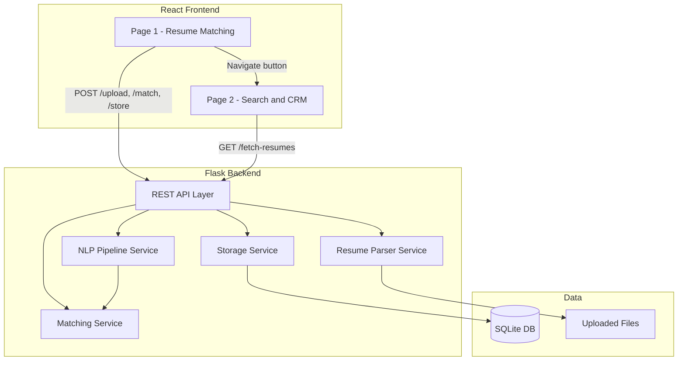

# ATS Resume Matching & CRM

Production-ready ATS with two pages: **Resume Matching** (JD + resume upload, NLP extraction, similarity scoring) and **Search/CRM** (filter and browse stored resumes). All skills, experience, and locations are inferred from job descriptions and resumes via spaCy, NLTK, and Sentence Transformers—no hardcoded lists.

## System Architecture



- **Page 1 flow:** User enters JD and uploads 1–8 resumes → `POST /upload` saves files and returns paths → `POST /match` runs parser + NLP + matching → results shown (match %, matching/missing skills, experience, locations, preview) → `POST /store` persists each resume to SQLite.
- **Page 2 flow:** User sets optional filters (location, skills ANY/ALL, experience) → `GET /fetch-resumes` returns filtered rows → table with preview.

## Tech Stack

- **Backend:** Python Flask  
- **NLP:** spaCy + NLTK + Sentence Transformers + cosine similarity  
- **Frontend:** React (Vite), desktop-focused  
- **Database:** SQLite  
- **Resume formats:** PDF, DOCX  

## SQLite Schema

Single table `resumes`:

| Column             | Type    | Description                          |
|--------------------|---------|--------------------------------------|
| resume_id          | INTEGER | Primary key, auto-increment          |
| name               | TEXT    | Original filename                    |
| extracted_skills  | TEXT    | JSON array of skill strings          |
| experience_years  | REAL    | Numeric years                        |
| locations          | TEXT    | JSON array of location strings       |
| match_percentage   | REAL    | 0–100 from matching run              |
| resume_file_path   | TEXT    | Relative path under uploads/         |
| uploaded_date      | TEXT    | ISO datetime                         |
| raw_text           | TEXT    | Extracted text for preview/highlight |

Indexes on `locations`, `experience_years`, `match_percentage`.

## NLP Logic (Step-by-Step)

### Skill extraction (no predefined list)

1. **Noun phrases (spaCy):** Run pipeline on JD/resume text; collect `doc.noun_chunks` and tokens with POS `NOUN`/`PROPN`.
2. **Filter:** Drop stopwords (NLTK), very short or very long phrases.
3. **Normalize:** Lowercase, trim; collect unique candidates.
4. **Deduplicate:** Embed all candidates with Sentence Transformers; merge near-duplicates by cosine similarity (e.g. ≥ 0.85); keep one representative per cluster.

### Experience extraction

1. **Regex patterns:** Match “N years”, “N+ years”, “N–Y years of experience”, “experience of N years”, etc.
2. **Parse numbers:** Extract numeric values; take the **maximum** across all matches as `experience_years`.

### Location extraction

1. **spaCy NER:** Use entities with label `GPE` or `LOC`.
2. **Clean:** Deduplicate and normalize casing.

### JD vs resume matching

1. **Document similarity:** Encode JD and resume text with Sentence Transformers; cosine similarity → mapped to 0–100% match score.
2. **Skill-level:** For each JD skill, compute embedding similarity to each resume skill; if max ≥ threshold (e.g. 0.7), count as **matching**. **Missing skills** = JD skills not in matching set.

## Run Instructions

### Backend

1. From project root (`p:\ATS\CRM`):

   ```bash
   cd p:\ATS\CRM
   python -m venv venv
   venv\Scripts\activate
   pip install -r backend\requirements.txt
   python -m spacy download en_core_web_sm
   ```

2. Start Flask (port 5000):

   ```bash
   set PYTHONPATH=%CD%
   python run_backend.py
   ```

   Or: `python -m flask run` with `FLASK_APP=backend.app` and `PYTHONPATH` set to project root.

### Frontend

1. In a new terminal:

   ```bash
   cd p:\ATS\CRM\frontend
   npm install
   npm run dev
   ```

2. Open http://localhost:3000. Page 1 = Resume Matching; use “Go to ATS Search / CRM” for Page 2. Vite proxies `/api` to the Flask backend.

## API Summary

| Method | Endpoint        | Description |
|--------|-----------------|-------------|
| POST   | `/api/upload`   | Form: `job_description`, `resumes` (1–8 files). Returns `job_description`, `resume_paths`. |
| POST   | `/api/match`    | JSON: `job_description`, `resume_paths`, `use_enhanced_matching` (optional, defaults to false). Returns `results` (match %, skills, experience, locations, raw_text, quality_category, explanation). |
| POST   | `/api/store`    | JSON: `resumes` array. Persists to SQLite. Returns `stored` count. |
| GET    | `/api/fetch-resumes` | Query: `location`, `skills`, `skills_mode` (any/all), `experience_years`. Returns `resumes`. |

## Resume Keyword Highlighting

- **Input:** Resume `raw_text` and list of `matching_skills`.
- **Process:** Escape regex in each skill; find all non-overlapping match ranges (case-insensitive); merge adjacent/overlapping; split text into segments.
- **Output:** Array of `{ type: 'text' | 'highlight', value }`; React renders `<mark>` for highlight segments.

## Enhanced Matching System

The system now includes an enterprise-grade matching algorithm with:

- **Semantic Role Understanding**: Advanced role intent classification with family, type, and specialization detection
- **Component-Based Scoring**: Four weighted components (Role Compatibility 40%, Skill Relevance 30%, Experience Alignment 20%, Semantic Similarity 10%)
- **Detailed Explanations**: Clear breakdown of why matches succeed or fail
- **Quality Categories**: Excellent/Good/Partial/Not Suitable classifications
- **False Positive Prevention**: Role family separation to prevent inappropriate matches (e.g., Developer vs Tester)
- **Context-Aware Skills**: Distinguishes between skills used professionally vs just listed

To use enhanced matching, include `use_enhanced_matching: true` in the match API request.

## Folder Structure

```
p:\ATS\CRM\
├── backend/
│   ├── app.py              # Flask app, CORS, routes
│   ├── config.py           # Paths, DB, model names
│   ├── requirements.txt
│   ├── api/                # upload, match, store, resumes
│   ├── services/           # resume_parser, nlp_pipeline, matching, storage
│   ├── models/             # schema (init_db, get_db)
│   └── utils/              # validation
├── frontend/               # Vite + React, pages, components, api.js, highlight.js
└── run_backend.py          # Run from project root
```

## Future Improvements & Scalability

- **NLP:** Larger Sentence Transformer model; job title extraction; custom skill NER with minimal seed data.
- **Backend:** PostgreSQL for concurrent writes; Celery + Redis for async `/match`; rate limiting and auth (API key or JWT).
- **Frontend:** Pagination and sort on Page 2; export to CSV; accessibility (ARIA, keyboard).
- **Ops:** Docker Compose; env-based config; S3 for uploads; DB backups.
